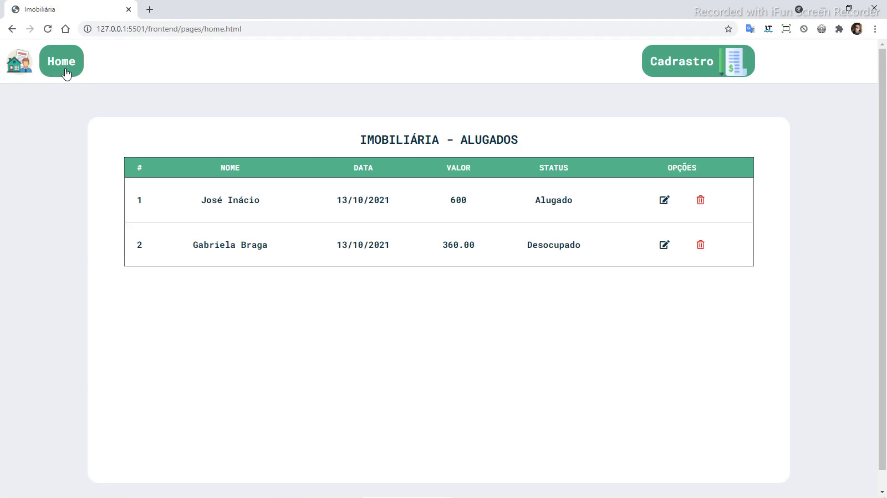
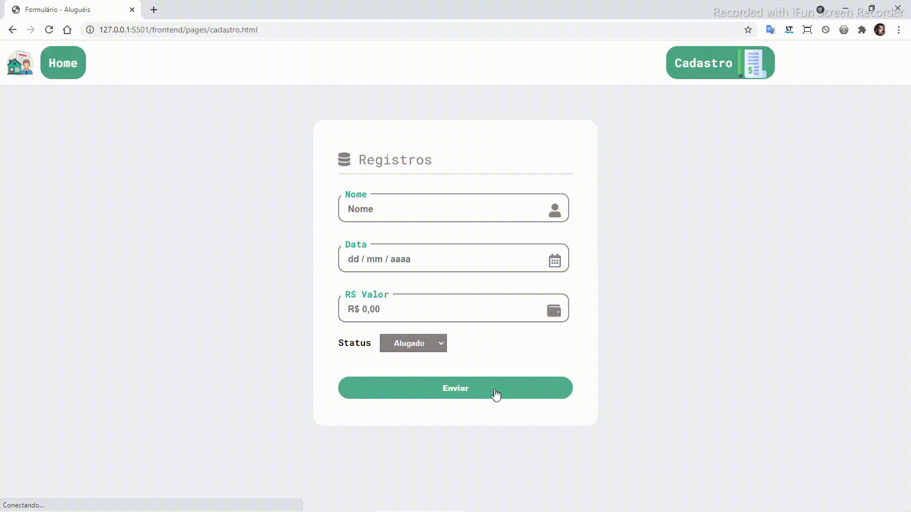
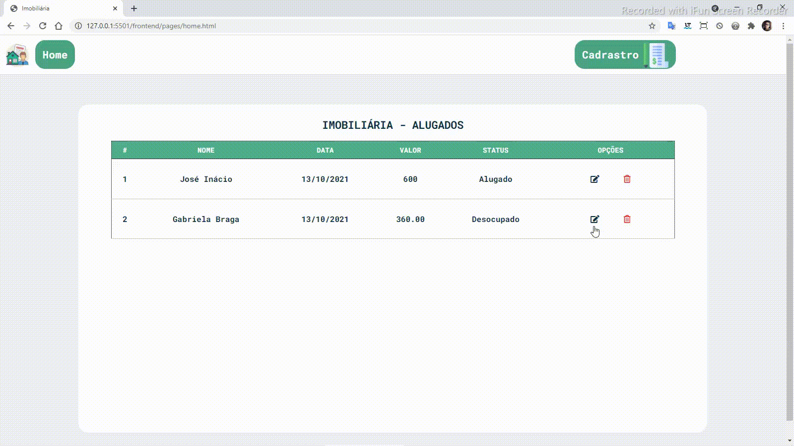
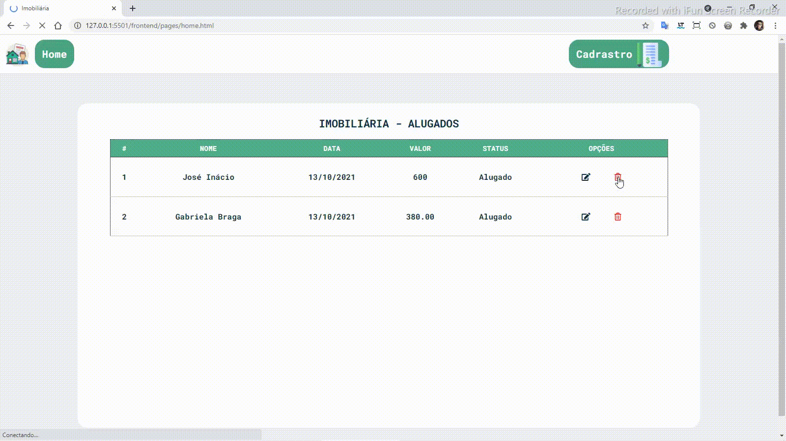

# Projeto: Calculadora - App 👨‍💻💻

    <a href="#sobre" align=center>Sobre</a>&nbsp;&nbsp;&nbsp;
    <a href="#status" align=center>Status</a>&nbsp;&nbsp;&nbsp;
    <a href="#linguagens" align=center>Linguages</a>&nbsp;&nbsp;&nbsp;
    <a href="#habilidades" align=center>Habilidades</a>&nbsp;&nbsp;&nbsp;
    <a href="#softwares" align=center>Softwares & Ferramentas</a>&nbsp;&nbsp;&nbsp;
    <a href="#autor" align=center>Autor</a> 

<h2 id="sobre">Sobre</h2> 

Sistema web page de cadastro, consulta, edição e exclusão de clientes (API) de imóveis.

  

 

<h2 id="status">Status</h2> 

***Concluído*** 🚀💻

 

<h2 id="habilidades">Habilidades Adquiridas 😊</h2> 

* Linguagem de programação JS
* Funções
* Métodos de requisição
* Arrays e validação de entrada de dados
* Estilização de interfaces para usuários interagirem
* Manipulação DOM

 

<h2 id="habilidades">Conheça as interfaces 💻</h2> 

## Cadastro

  

## Consulta

  

## Edição

  

## Exclusão

  

<h2 id="linguagens">Linguagens de Desenvolvimento | Linguagens de Programação | FrameWorks</h2> 

* Html
* CSS
* JavaScript
* JSON Server (NPM)
* Axios (NPM)

 

<h2 id="autor">Autor</h2> 

 Meu nome é Leonardo, mas gosto de ser o Leo. Estou me graduando em Sistemas de Informação. Sou Desenvolvedor Front-End (estagiário) na AjaxTI.
 

<h3 align=center><i>Gostos e Hobbies </i>📖🙋‍♂️</h3>  

Caminhar, correr, ciclismo, exercícios físicos, estudar, ler e aprender sobre desenvolvendo de sites e aplicações.
 

    <h3><strong>Contatos</strong></h3>
     
    
    &nbsp;&nbsp;&nbsp;&nbsp;&nbsp;&nbsp;&nbsp;&nbsp;&nbsp;
     
    &nbsp;&nbsp;&nbsp;&nbsp;&nbsp;&nbsp;&nbsp;&nbsp;&nbsp;
       
    &nbsp;&nbsp;&nbsp;&nbsp;&nbsp;&nbsp;&nbsp;&nbsp;&nbsp;
    

